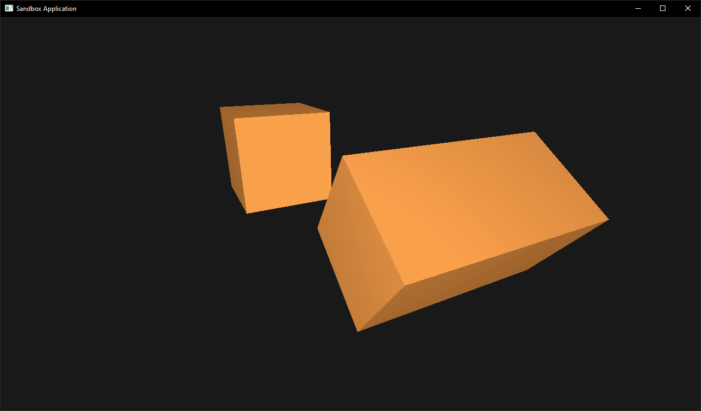

<!-- Horus -->

<!-- Logo -->

<!-- Title -->

# Horus

[![ci-badge-linux]][ci-url-linux] [![ci-badge-windows]][ci-url-windows] [![license-badge]][license-url] [![c-badge]][c-url] [![opengl-badge]][opengl-url] [![meson-badge]][meson-url]

<!-- Short Description -->

> A simple cross-platform application development framework.

<!-- Description -->

This project is being developed to be the simplest and yet complete cross-platform application development framework using the [C][c-url] programming language, [OpenGL][opengl-url] graphics API and [Meson][meson-url] build system.

<!-- Screenshot -->

<!-- Links -->

[ci-url-linux]: https://github.com/thiago-rezende/horus/actions/workflows/linux.yml
[ci-url-windows]: https://github.com/thiago-rezende/horus/actions/workflows/windows.yml
[license-url]: https://opensource.org/licenses/BSD-3-Clause
[c-url]: https://en.cppreference.com/w/c
[opengl-url]: https://www.opengl.org
[meson-url]: https://mesonbuild.com

<!-- Badges -->

[ci-badge-linux]: https://img.shields.io/github/actions/workflow/status/thiago-rezende/horus/linux.yml?branch=main&style=flat-square&label=linux
[ci-badge-windows]: https://img.shields.io/github/actions/workflow/status/thiago-rezende/horus/windows.yml?branch=main&style=flat-square&label=windows
[license-badge]: https://img.shields.io/badge/license-BSD_3_Clause-yellowgreen.svg?style=flat-square
[c-badge]: https://img.shields.io/badge/C-11-blue.svg?style=flat-square
[opengl-badge]: https://img.shields.io/badge/OpenGL-4.6-5586A5.svg?style=flat-square
[meson-badge]: https://img.shields.io/badge/meson-1.0-39207c.svg?style=flat-square
